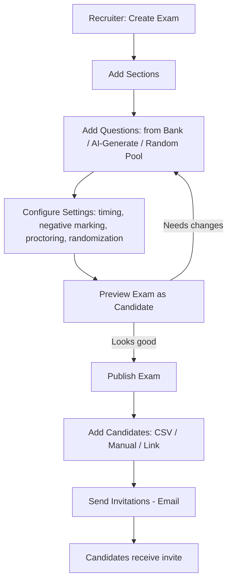
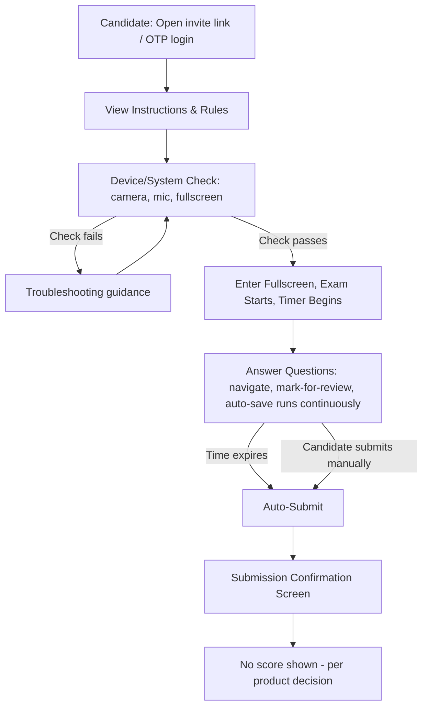
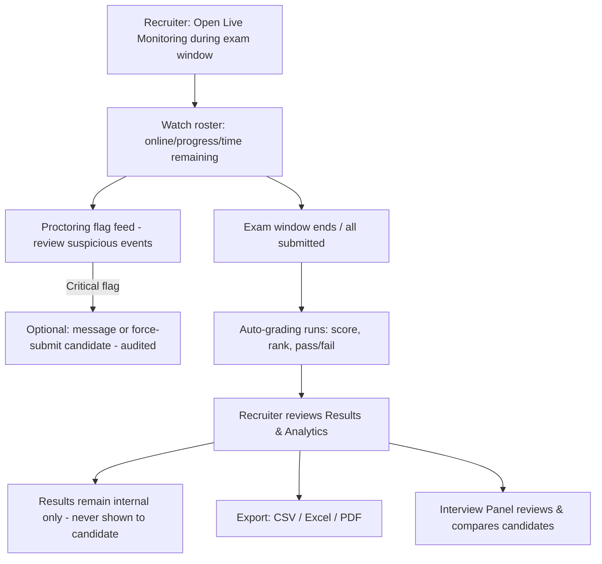
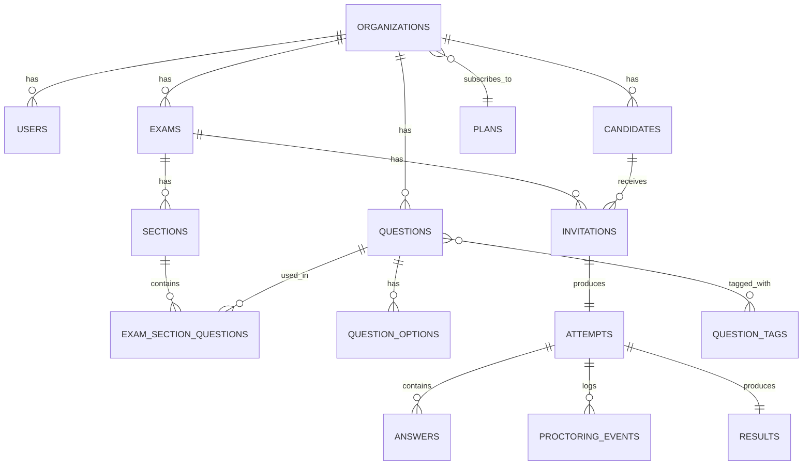
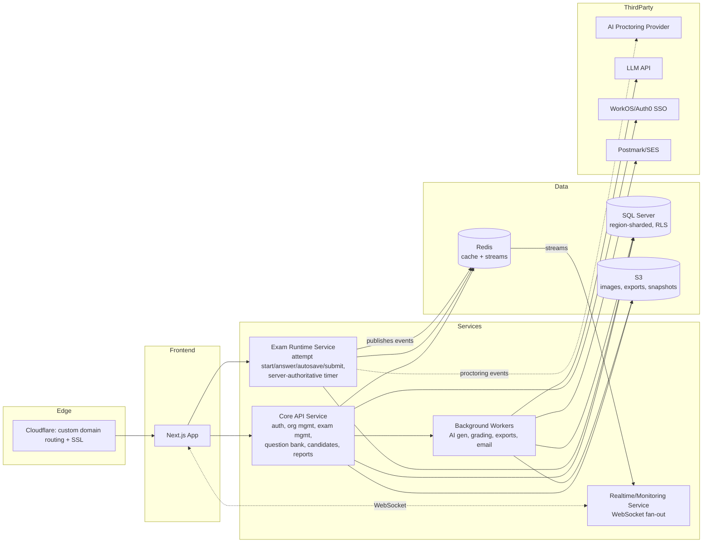

# Online MCQ Examination Platform — Product & Design Spec

**Status:** Complete draft — all 16 sections, pending team review.
**Date:** 2026-07-07

---

## 1. Requirement Analysis

| Dimension | Decision |
|---|---|
| Deployment model | White-label multi-tenant SaaS — each client org gets custom domain + full branding |
| Scale | 10,000+ concurrent candidates per exam |
| Candidate auth | Invite link/token (primary) + Email OTP (fallback/direct login) |
| Question types (v1) | Single-correct MCQ, Multiple-correct MCQ, True/False (Fill-in-blank, coding, subjective → future) |
| Negative marking | Yes, configurable per question |
| Timing | Overall timer + per-section timers + scheduled exam windows |
| Randomization | Random question order, random option order, random selection from question pool |
| Difficulty | Easy/Medium/Hard tagging |
| Languages | English only (v1); i18n-ready architecture for future |
| Result visibility | Never shown to candidate — results are internal-only to recruiters/panel; candidate sees only a submission confirmation |
| Certificates | Not needed |
| Proctoring | Full AI proctoring via third-party integration (webcam, face/gaze, screen) |
| Interview panel | View-only in v1 (no formal evaluation workflow yet) |
| Notifications | Email only (SMS/WhatsApp → future) |
| AI features (v1) | AI proctoring, AI-generated questions, AI-based evaluation insights/summaries |
| Compliance | GDPR, SOC 2 readiness, region-based data residency |
| Tech stack | Open — best-fit modern stack, cloud-agnostic where practical |
| Auditor/Compliance role | Deferred — out of v1 scope |

---

## 2. Product Vision

**Vision statement:** A white-label, enterprise-grade online assessment platform that lets any recruiting organization launch secure, branded, AI-proctored MCQ exams at any scale — from a 20-person startup screening round to a 10,000-candidate national hiring drive — without building their own exam infrastructure.

**Positioning:** This sits between generic exam tools (Google Forms, lightweight quiz tools) and heavyweight enterprise assessment suites (Mercer Mettl, HackerRank). Differentiators:
- **Multi-tenant white-label** — each client can present the platform as entirely their own (custom domain, branding, emails).
- **Built-in AI proctoring** integrated from day one, not bolted on later.
- **AI-assisted authoring** — recruiters can generate a first draft of a question bank from a job description/topic instead of writing 100 MCQs by hand.
- **Scale-first architecture** — designed for mass concurrent drives (10K+), not retrofitted.

**Primary business model implication:** Organizations are the billable unit (tenant). Plans likely gate: candidate volume, custom domain, AI proctoring minutes, AI question generation credits, data residency region. (Noted for later monetization design — not a v1 architecture blocker beyond keeping these things metering-friendly.)

### Key architecture decisions (already agreed)

1. **Multi-tenancy:** Shared database, row-level isolation via `organization_id` + SQL Server Row-Level Security (native Security Policies), with region-sharded deployments (e.g., separate EU/US clusters) to satisfy data residency — not database-per-tenant.
2. **AI Proctoring:** Integrate a specialized third-party proctoring provider behind an internal pluggable interface, rather than building proctoring ML in-house or going record-only.
3. **Real-time scale:** Event-driven architecture — WebSockets/SSE for candidate timer sync and auto-save, message broker (Redis Streams/Kafka) fanning out events to the live-monitoring dashboard — not polling-based.

---

## 3. User Roles

### Platform Super Admin (platform operator)
- Manage client organizations (tenants): onboarding, suspension, billing tier
- Configure global platform settings, feature flags per tenant plan
- Manage the AI proctoring provider integration, optional shared question bank templates
- Cross-tenant platform analytics (usage, health — not exam content)
- Global audit logs, security monitoring
- Audited support impersonation into a tenant

### Organization Admin (client's admin)
- Owns the org's branding/custom domain configuration
- Manages recruiters/panel members within their org (invite, roles, permissions)
- Manages org-wide billing/plan, candidate volume usage
- Views org-wide analytics across all recruiters' exams
- Configures org-level security policy (e.g., mandatory proctoring, session rules)

### Recruiter / HR
- Create/edit/clone/delete/archive exams
- Build sections, assign questions from bank or pool-based random selection
- Manage question bank (org-scoped)
- Invite candidates (bulk CSV, manual, link)
- Schedule exams, configure timing/negative marking/randomization per exam
- Monitor live exams
- View reports, export results
- Review results internally (results are never shown to candidates in v1)

### Interview Panel (view-only in v1)
- View candidate performance, section/question-wise scores
- Compare candidates side-by-side
- *(Future: evaluation notes/hire recommendation workflow)*

### Candidate
- Receive invitation (email link or OTP-based login)
- View instructions, complete system/device check (webcam/mic check for proctoring)
- Attend exam under proctoring
- Submit exam
- No result visibility — sees only a submission confirmation

*(Auditor/Compliance Viewer role considered and explicitly deferred post-v1 to keep scope tight.)*

---

## 4. Feature List by Module

### Authentication & Identity
- Candidate: invite-link login (tokenized, single-use or time-boxed), Email OTP login
- Staff (Super Admin/Org Admin/Recruiter/Panel): Email + password, SSO (Google/Microsoft) for enterprise orgs
- Password reset, forced password rotation policy (enterprise option)
- Two-Factor Authentication for staff roles (recommended mandatory for Org Admin)
- Session management: device/session listing, remote sign-out, single-active-session enforcement for candidates during an exam
- JWT access + refresh token rotation

### Platform / Organization Management (Super Admin)
- Tenant onboarding (create org, assign plan/limits)
- Custom domain configuration + SSL provisioning workflow
- Branding config (logo, colors, email templates) per org
- Plan/limit management (candidate volume, AI credits, proctoring minutes)
- Feature flagging per org (e.g., enable AI question gen, enable SSO)
- Cross-tenant analytics & platform health dashboard
- Global audit log viewer
- Support impersonation (audited)

### Dashboard (role-specific)
- Org Admin: org-wide stats, recruiter activity, usage vs. plan limits
- Recruiter: active/upcoming/completed exams, quick stats, notifications
- Panel: assigned candidate reviews pending
- Candidate: upcoming invitations, exam history

### Exam Management
- Create / Edit / Clone / Delete / Archive exam
- Draft mode → Publish workflow
- Section builder (multiple sections, per-section timer, per-section question count/pool)
- Schedule exam (fixed window, or open-window with per-candidate start-on-launch)
- Exam-level settings: negative marking default, randomization toggles, proctoring level, pass criteria
- Preview exam as candidate before publishing

### Question Bank
- Question types: Single-correct MCQ, Multiple-correct MCQ, True/False
- Metadata: tags, topic, category, difficulty (Easy/Medium/Hard), marks, negative marks
- Rich text editor (formatting), image support, mathematical equation support
- Bulk import (CSV/Excel template), bulk export
- Question versioning (edit history)
- **AI-generated questions**: input topic/JD/skill → generate draft MCQs for recruiter review/edit before adding to bank
- Duplicate detection on import (basic dedup by text similarity)

### Candidate Management
- Manual add, CSV bulk upload, invite by email, invite by shareable link
- Candidate groups/batches (e.g., "Campus Drive 2026 — Batch A")
- Status tracking: Invited → Started → In Progress → Submitted → Expired/No-show
- Resend invitation, revoke invitation

### Exam Engine (candidate-facing runtime)
- Pre-exam instructions screen + system/device check (camera/mic check for proctoring)
- Overall timer + per-section timer, auto-submit on expiry
- Auto-save answers (periodic + on every answer change)
- Resume on reconnect/refresh (state restored from last auto-save)
- Full-screen enforcement
- Question navigation: next/previous, jump-to, mark-for-review, skip
- Random question order, random option order, random pool selection
- Section lock (no going back once section time expires or candidate moves forward, if configured)
- Auto-submit at time expiry

### Anti-Cheating / Proctoring
- Browser-level: tab-switch detection, fullscreen-exit detection, copy/paste block, right-click disable, dev-tools detection, browser refresh warning, idle detection
- Device/session: device fingerprinting, multiple-login/session detection, single active session enforcement
- **AI Proctoring (third-party integrated)**: webcam monitoring, face presence/match verification, multiple-face detection, gaze/attention flagging, audio anomaly detection (optional), screen recording
- All events logged as timestamped flags with severity, surfaced to recruiter — **no automatic disqualification**; recruiter/panel makes the final call

### Live Monitoring (recruiter-facing)
- Real-time candidate roster: online/offline, progress %, remaining time
- Real-time proctoring flag feed (suspicious activity alerts)
- Disconnection/reconnection alerts
- Submission status feed
- Ability to message/force-submit a candidate (admin override, audited)

### Evaluation & Results
- Auto-grading: score, percentage, pass/fail against configured cutoff
- Rank (within exam/batch)
- Section-wise, topic-wise, question-wise breakdown
- Internal result review only — no candidate-facing result disclosure in v1
- Candidate comparison view (side-by-side, for Panel + Recruiter)

### Analytics Dashboard
- Pass rate, average score, score distribution
- Difficulty analysis (accuracy per difficulty tier)
- Time-per-question analysis
- Question accuracy/discrimination index (flag questions too easy/hard/ambiguous)
- Candidate ranking, batch comparison
- Proctoring flag summary (trend of suspicious activity across an exam)
- **AI-based evaluation insights**: auto-generated candidate summary (e.g., "strong in SQL, weak in system design, 2 proctoring flags — tab switch") for Recruiter/Panel

### Notifications
- Email: invitation, reminder (T-24h/T-1h), exam-started confirmation, submission confirmation, result-published (if enabled), account/security emails
- Notification templates brandable per org (white-label)
- *(Future: SMS, WhatsApp)*

### Reports & Export
- Candidate-wise, exam-wise, batch-wise reports
- CSV/Excel export, PDF report export
- *(Future: scheduled/automated report emails)*

### Settings
- Org profile, branding, custom domain
- Roles & permissions management
- Notification template settings
- Security policy (2FA enforcement, session rules, proctoring defaults)
- API key management (for future public API access)

---

## 5. User Stories

**Org Admin**
- As an Org Admin, I want to configure our custom domain and branding so candidates experience our company's identity, not the platform's.
- As an Org Admin, I want to invite recruiters and assign roles so my team can start creating exams without me being a bottleneck.
- As an Org Admin, I want to see usage against our plan limits (candidates, AI credits) so I don't get surprised by overage.

**Recruiter**
- As a Recruiter, I want to build an exam from a question pool with randomized selection so no two candidates get an identical paper.
- As a Recruiter, I want to bulk-upload 5,000 candidates via CSV and invite them all at once for a campus drive.
- As a Recruiter, I want to generate a first draft of 30 MCQs from a job description using AI so I don't start from a blank question bank.
- As a Recruiter, I want to watch a live dashboard during the exam window so I can spot mass disconnections or proctoring issues in real time.
- As a Recruiter, I want results to stay strictly internal to HR/Panel, since candidates should never see their scores through the platform.

**Interview Panel**
- As a Panel member, I want to compare two candidates' section-wise scores side-by-side so I can make a shortlisting decision.
- As a Panel member, I want to see proctoring flags alongside scores so I can factor integrity concerns into my judgment.

**Candidate**
- As a Candidate, I want a clear pre-exam device check so I know my camera/mic work before the exam starts, not during it.
- As a Candidate, I want my answers auto-saved so a browser crash doesn't cost me my progress.
- As a Candidate, I want a visible countdown timer per section so I can pace myself.

**Super Admin**
- As a Super Admin, I want to onboard a new enterprise client and provision their custom domain without engineering involvement each time.
- As a Super Admin, I want cross-tenant health visibility (error rates, exam load) so I can catch platform issues before a client does.

---

## 6. Screen List

### Public / Auth
- Login (staff) — email/password, SSO button
- Candidate login (OTP entry / invite-link landing)
- Forgot Password / Reset Password
- 2FA challenge screen

### Super Admin
- Platform Dashboard (cross-tenant health/usage)
- Organizations list / Organization detail (plan, limits, domain, branding config)
- Global Audit Log
- Feature Flags / Plan Configuration
- Support Impersonation launcher

### Org Admin
- Org Dashboard (usage vs. plan, recruiter activity)
- Team Management (recruiters, panel members, roles/permissions)
- Branding & Domain Settings
- Org Security Policy Settings
- Org-wide Billing/Plan page

### Recruiter
- Recruiter Dashboard (active/upcoming/completed exams)
- Exam List
- Create/Edit Exam (multi-step: details → sections → questions → settings → schedule)
- Exam Preview (candidate-view simulation)
- Question Bank (list, filters by tag/topic/difficulty)
- Question Editor (rich text, image, equation support)
- AI Question Generator panel
- Bulk Import Question Bank (upload + mapping + validation results)
- Candidate List (per exam) + Bulk Upload/Invite flow
- Candidate Groups management
- Live Monitoring Dashboard
- Results & Reports (exam-level, candidate-level, export)
- Analytics Dashboard

### Interview Panel
- Panel Dashboard (assigned exams/candidates)
- Candidate Report Detail (section/question breakdown, proctoring flags)
- Candidate Comparison view

### Candidate
- Invitation landing page
- Instructions / Rules screen
- Device/System Check (camera, mic, fullscreen prompt)
- Exam Screen (question view, navigation panel, timer, mark-for-review)
- Submission Confirmation screen
- Exam History (past attempts, statuses — no scores, per product decision)
- Profile (minimal: name, contact, password)

### Shared
- Notification Center
- 404 / Error / Session Expired / Exam Locked-Out screens
- Maintenance / Org Suspended screen (for suspended tenants)

---

## 7. UI/UX Design System

Since this is white-label, the design system needs two layers: a **fixed structural system** (layout, spacing, components, accessibility) and a **tenant theme layer** (colors, logo, fonts optionally) that each org configures. This is the standard way white-label products avoid rebuilding UI per client.

**Design principles:** Clean, minimal, professional, high information density where it matters (dashboards, monitoring) but distraction-free during the exam itself (candidate exam screen is deliberately the most stripped-down surface in the product — no branding flourishes, no navigation chrome, nothing that could be a distraction or exploit vector).

**Color Palette (base system — tenant overrides primary/accent only):**
- Neutral scale (backgrounds, borders, text): 9-step gray scale, e.g. `gray-50` → `gray-900`
- Primary (tenant-overridable): default indigo/blue, replaced by tenant brand color
- Semantic colors (fixed, not tenant-overridable — integrity matters more than branding here): success (green), warning (amber), danger/critical (red), info (blue) — used consistently for proctoring flags, pass/fail, validation
- Dark mode: full parallel palette, not just inverted neutrals

**Typography:**
- One system font stack for UI (e.g., Inter/system-ui) — legibility over personality, especially for the exam-taking screen
- Type scale: 6-7 steps (e.g., 12/14/16/18/24/32px), consistent line-height ratios
- Monospace font reserved for code-like content (e.g., candidate tokens, IDs)

**Spacing System:** 4px base unit, scale of 4/8/12/16/24/32/48/64 — used for all padding/margin/gap, no arbitrary values

**Icon style:** Single consistent icon set (outline style, e.g., Lucide/Heroicons), 2px stroke weight, sized on the same 4px grid

**Components (design system library):**
- Core: Button, Input, Select, Checkbox/Radio, Modal, Toast, Table (with sort/filter/paginate), Tabs, Badge/Tag, Card, Dropdown Menu, Timer component, Progress bar
- Exam-specific: Question Card, Option Selector (single/multi), Section Navigator, Countdown Timer (with warning states at 5min/1min), Flag/Mark-for-review indicator
- Monitoring-specific: Live status pill, Candidate roster row, Alert feed item

**Accessibility:** WCAG 2.1 AA target — color contrast ratios enforced in the palette itself (not left to chance), full keyboard navigation for the exam screen (critical — candidates with motor impairments must be able to complete exams without a mouse), visible focus states, screen-reader labels on all interactive elements, respects `prefers-reduced-motion`.

**Responsive/Mobile:** Recruiter/Admin surfaces are desktop-first but responsive down to tablet. The candidate exam-taking screen is desktop/tablet-optimized; mobile phone exam-taking is intentionally **discouraged by default** (small screens + proctoring camera framing + multitasking risk are a bad combination for exam integrity) — recruiters can allow it per-exam if they choose, but it's opt-in, not the default.

**Light/Dark mode:** Both supported across staff-facing surfaces; candidate exam screen defaults to light mode only (better for proctoring camera exposure/lighting consistency, and reduces visual variables during a monitored session) but can inherit tenant preference.

---

## 8. Information Architecture

Navigation structure per role — this becomes the primary nav/sidebar in each surface:

```
Super Admin Console
├── Platform Dashboard
├── Organizations
│   └── [Org Detail: Plan / Domain / Branding / Usage]
├── Global Audit Log
├── Feature Flags & Plans
└── Platform Settings

Org Admin Console
├── Org Dashboard
├── Team (Recruiters / Panel members / Roles)
├── Branding & Domain
├── Security Policy
└── Billing & Usage

Recruiter Console
├── Dashboard
├── Exams
│   └── [Exam Detail: Sections / Questions / Settings / Schedule / Preview]
├── Question Bank
│   └── [AI Generator / Bulk Import]
├── Candidates
│   └── [Groups / Bulk Upload / Invitations]
├── Live Monitoring   (active only during a running exam window)
├── Reports & Analytics
└── Settings (personal)

Interview Panel Console
├── Dashboard (assigned candidates)
├── Candidate Reports
└── Comparison view

Candidate Portal   (minimal chrome, no persistent nav during exam)
├── Invitations / History
├── Instructions → Device Check → Exam → Submission
└── Profile
```

**IA principle:** Each role sees only their own top-level nav — there is no unified "god nav" that shows all modules and hides/greys out unavailable ones. This avoids overwhelming Recruiters with Org Admin/Super Admin concepts and reduces the surface area for permission-check bugs (if it's not in the nav for that role, that role's frontend bundle doesn't need to know it exists).

---

## 9. User Flow

### Flow A: Recruiter creates exam → publishes → invites candidates



### Flow B: Candidate attempts exam



Proctoring events (tab-switch, face-not-detected, multi-face, etc.) are captured continuously during step E and streamed to the Live Monitoring dashboard in real time, independent of the candidate's own flow — the candidate is not shown flags or warnings that would change their behavior (avoids "gaming" the proctoring signal).

### Flow C: Recruiter monitors → reviews reports → exports results



---

## 10. Database Design

**Engine:** SQL Server (2019+). **Tenancy:** every tenant-scoped table carries `organization_id` (UNIQUEIDENTIFIER) with a native Row-Level Security policy — a security predicate function checking `organization_id = CAST(SESSION_CONTEXT(N'app_current_org') AS UNIQUEIDENTIFIER)`, applied via `CREATE SECURITY POLICY`. All primary keys are UNIQUEIDENTIFIER/GUID (avoids sequential-ID enumeration across tenants, works cleanly with region-sharded instances).

**Note on JSON columns:** SQL Server has no native JSON column type (unlike Postgres `jsonb`). All `*_json` fields below (`branding_json`, `settings_json`, `metadata_json`, etc.) are `NVARCHAR(MAX)` validated with `ISJSON()` and queried via `JSON_VALUE`/`JSON_QUERY` — functionally equivalent, slightly more verbose in queries, no loss of capability for this schema's needs (nothing here relies on Postgres-specific GIN/JSONB indexing).

### Core entity relationships (simplified)



### Table definitions

**organizations**
`id (PK, UUID)`, `name`, `slug (unique)`, `custom_domain (unique, nullable)`, `branding_json`, `region (enum: eu/us/...)`, `plan_id (FK→plans)`, `status (active/suspended)`, `created_at`
Index: `custom_domain`, `slug`

**plans**
`id (PK)`, `name`, `candidate_limit`, `ai_credit_limit`, `proctoring_minutes_limit`, `features_json`, `price_json`

**users** (staff: super_admin / org_admin / recruiter / panel)
`id (PK, UUID)`, `organization_id (FK, nullable for super_admin)`, `email (unique per org)`, `password_hash`, `role`, `sso_subject_id (nullable)`, `mfa_enabled`, `status`, `last_login_at`, `created_at`
Index: `(organization_id, email)`, `organization_id`

**roles / permissions / role_permissions**
`roles(id, organization_id nullable for system roles, name)`, `permissions(id, key, description)`, `role_permissions(role_id FK, permission_id FK)` — system-defined roles (Super Admin, Org Admin, Recruiter, Panel) ship as fixed rows; table exists so Org Admins can later customize permission sets without a schema change.

**candidates**
`id (PK, UUID)`, `organization_id (FK)`, `email`, `name`, `phone (nullable)`, `external_ref (nullable, for ATS linkage later)`, `created_at`
Index: `(organization_id, email)`

**candidate_groups** / **candidate_group_members**
`candidate_groups(id, organization_id, name, description, created_at)`
`candidate_group_members(candidate_id FK, group_id FK)` — composite PK

**exams**
`id (PK, UUID)`, `organization_id (FK)`, `created_by (FK→users)`, `title`, `instructions`, `status (draft/published/archived)`, `duration_minutes`, `pass_criteria_percent`, `proctoring_level`, `negative_marking_default`, `settings_json` (randomization toggles, section-lock, allow-mobile), `schedule_start`, `schedule_end`, `created_at`, `updated_at`
Index: `(organization_id, status)`, `(organization_id, schedule_start)`

**sections**
`id (PK, UUID)`, `exam_id (FK)`, `title`, `order_index`, `duration_minutes (nullable)`, `question_selection_mode (fixed/random_pool)`, `pool_question_count (nullable)`
Index: `exam_id`

**questions** (org-scoped bank, reusable across exams)
`id (PK, UUID)`, `organization_id (FK)`, `type (single_mcq/multi_mcq/true_false)`, `text (rich text/HTML)`, `image_url (nullable)`, `difficulty (easy/medium/hard)`, `topic`, `category`, `marks`, `negative_marks`, `ai_generated (bool)`, `version`, `status (active/archived)`, `created_by`, `created_at`
Index: `(organization_id, topic, difficulty)`, `organization_id`

**question_options**
`id (PK, UUID)`, `question_id (FK)`, `text`, `is_correct (bool)`, `order_index`
Index: `question_id`

**question_tags** / **question_tag_map**
`question_tags(id, organization_id, name)`
`question_tag_map(question_id FK, tag_id FK)` — composite PK

**exam_section_questions** (fixed-selection mode link)
`section_id (FK)`, `question_id (FK)`, `order_index` — composite PK

**section_pool_criteria** (random-pool mode: which tags/difficulty to pull from)
`id (PK)`, `section_id (FK)`, `tag_id (FK, nullable)`, `difficulty (nullable)`, `count`

**invitations**
`id (PK, UUID)`, `exam_id (FK)`, `candidate_id (FK)`, `token (unique)`, `status (invited/started/in_progress/submitted/expired/revoked)`, `invited_at`, `expires_at`
Index: `token (unique)`, `(exam_id, status)` — this composite index is what powers the live-monitoring roster query at 10K+ scale

**attempts**
`id (PK, UUID)`, `invitation_id (FK, unique)`, `candidate_id (FK)`, `exam_id (FK)`, `started_at`, `submitted_at (nullable)`, `status (in_progress/submitted/auto_submitted)`, `question_order_json`, `option_order_json`, `device_fingerprint`, `ip_address`, `last_autosave_at`
Index: `invitation_id (unique)`, `(exam_id, status)`

**answers**
`id (PK, UUID)`, `attempt_id (FK)`, `question_id (FK)`, `selected_option_ids_json`, `is_marked_for_review`, `answered_at`, `is_correct (nullable, computed at grading)`, `marks_awarded (nullable)`
Index: `(attempt_id, question_id) unique`

**results**
`id (PK, UUID)`, `attempt_id (FK, unique)`, `score`, `max_score`, `percentage`, `rank (nullable, computed per exam)`, `pass_fail`, `computed_at`
Results are internal-only in v1 — no candidate-facing visibility field exists; a "recruiter-controlled release to candidate" toggle is a Future Enhancement, not part of this schema.
Index: `attempt_id (unique)`, `(exam_id via join, rank)` — denormalized `exam_id` column added for direct ranking queries

**proctoring_events**
`id (PK, UUID)`, `attempt_id (FK)`, `event_type (tab_switch/fullscreen_exit/face_not_detected/multi_face/...)`, `severity (low/medium/high)`, `occurred_at`, `metadata_json (confidence score, snapshot URL)`
Index: `(attempt_id, occurred_at)`, `(attempt_id, severity)`

**audit_logs**
`id (PK, UUID)`, `organization_id (nullable = platform-level)`, `actor_user_id (nullable)`, `action`, `entity_type`, `entity_id`, `metadata_json`, `ip_address`, `created_at`
Index: `(organization_id, created_at)`, `(entity_type, entity_id)`

**notifications**
`id (PK, UUID)`, `organization_id (FK)`, `recipient_type (candidate/user)`, `recipient_id`, `channel (email)`, `template_key`, `status (queued/sent/failed)`, `sent_at`, `created_at`
Index: `(organization_id, status)`

**ai_generation_jobs**
`id (PK, UUID)`, `organization_id (FK)`, `requested_by (FK→users)`, `job_type (question_generation/evaluation_insight)`, `input_json`, `output_json (nullable)`, `status (queued/running/completed/failed)`, `credits_used`, `created_at`

**refresh_tokens / sessions**
`id (PK, UUID)`, `subject_type (user/candidate)`, `subject_id`, `token_hash`, `device_info`, `ip_address`, `expires_at`, `revoked_at (nullable)`
Index: `token_hash (unique)`, `(subject_type, subject_id)`

**Design notes:**
- One `attempt` per `invitation` in v1 (no reattempts) — kept as a 1:1 FK rather than 1:N to match confirmed scope; reattempts would just relax this constraint later, no schema rework needed.
- `answers.is_correct`/`marks_awarded` are computed at grading time, not at answer time — keeps the exam-taking write path fast (no scoring logic on the hot path while thousands of candidates are actively answering).
- `results.exam_id` is intentionally denormalized (not just reachable via `attempt→invitation→exam`) purely so ranking queries don't need a 3-way join under load.

---

## 11. API Design

REST, versioned under `/api/v1/`. Auth via JWT (access + refresh). Tenant resolved from custom domain or subdomain at the edge, injected as `organization_id` context for every request (never trusted from client payload).

### Authentication
```
POST   /api/v1/auth/staff/login              (email + password)
POST   /api/v1/auth/staff/sso/callback
POST   /api/v1/auth/staff/mfa/verify
POST   /api/v1/auth/candidate/otp/request
POST   /api/v1/auth/candidate/otp/verify
POST   /api/v1/auth/candidate/invite/redeem   (exchanges invite token for session)
POST   /api/v1/auth/refresh
POST   /api/v1/auth/logout
POST   /api/v1/auth/password/forgot
POST   /api/v1/auth/password/reset
```

### Organizations (Super Admin)
```
GET    /api/v1/organizations
POST   /api/v1/organizations
GET    /api/v1/organizations/{id}
PATCH  /api/v1/organizations/{id}
PATCH  /api/v1/organizations/{id}/branding
PATCH  /api/v1/organizations/{id}/domain
PATCH  /api/v1/organizations/{id}/plan
POST   /api/v1/organizations/{id}/suspend
```

### Team / Users (Org Admin)
```
GET    /api/v1/users
POST   /api/v1/users/invite
PATCH  /api/v1/users/{id}/role
DELETE /api/v1/users/{id}
```

### Exams
```
GET    /api/v1/exams
POST   /api/v1/exams
GET    /api/v1/exams/{id}
PATCH  /api/v1/exams/{id}
POST   /api/v1/exams/{id}/clone
DELETE /api/v1/exams/{id}
POST   /api/v1/exams/{id}/publish
POST   /api/v1/exams/{id}/archive
POST   /api/v1/exams/{id}/sections
PATCH  /api/v1/exams/{id}/sections/{sectionId}
DELETE /api/v1/exams/{id}/sections/{sectionId}
POST   /api/v1/exams/{id}/sections/{sectionId}/questions   (attach fixed question)
PUT    /api/v1/exams/{id}/sections/{sectionId}/pool-criteria (random pool config)
GET    /api/v1/exams/{id}/preview
```

### Question Bank
```
GET    /api/v1/questions?tag=&difficulty=&topic=
POST   /api/v1/questions
GET    /api/v1/questions/{id}
PATCH  /api/v1/questions/{id}
DELETE /api/v1/questions/{id}
POST   /api/v1/questions/bulk-import      (CSV/XLSX upload, returns validation report)
GET    /api/v1/questions/bulk-export
POST   /api/v1/questions/ai-generate      (topic/JD → draft questions, async job)
GET    /api/v1/ai-jobs/{id}               (poll generation job status)
```

### Candidates & Invitations
```
GET    /api/v1/candidates
POST   /api/v1/candidates
POST   /api/v1/candidates/bulk-import
POST   /api/v1/candidate-groups
POST   /api/v1/exams/{id}/invitations                (invite candidates to an exam)
POST   /api/v1/exams/{id}/invitations/bulk
POST   /api/v1/invitations/{id}/resend
POST   /api/v1/invitations/{id}/revoke
GET    /api/v1/exams/{id}/invitations                 (status roster)
```

### Candidate Exam Runtime
```
GET    /api/v1/attempt/current                        (resume state on load/refresh)
POST   /api/v1/attempt/start
POST   /api/v1/attempt/answer                          (upsert single answer, called on every change)
POST   /api/v1/attempt/autosave                        (periodic full-state checkpoint)
POST   /api/v1/attempt/submit
POST   /api/v1/attempt/proctoring-event                (client-reported: tab-switch, fullscreen-exit, etc.)
WS     /ws/attempt/{attemptId}                         (server timer authority, connection-liveness, forced-submit push)
```
Note: exam **timer authority lives server-side**; the client displays a countdown driven by server time, not a client-side clock — prevents trivial clock-tampering cheats.

### Live Monitoring (Recruiter)
```
GET    /api/v1/exams/{id}/monitoring/roster
WS     /ws/exams/{id}/monitoring                       (real-time roster + proctoring flag feed)
POST   /api/v1/attempts/{id}/force-submit               (audited admin override)
POST   /api/v1/attempts/{id}/message                    (candidate-facing notice, e.g. "5 min remaining")
```

### Evaluation, Reports, Analytics
```
GET    /api/v1/exams/{id}/results                      (internal only - recruiter/panel access)
GET    /api/v1/attempts/{id}/report                    (question/section breakdown)
GET    /api/v1/exams/{id}/analytics                    (pass rate, difficulty analysis, time analysis)
GET    /api/v1/exams/{id}/export?format=csv|xlsx|pdf
GET    /api/v1/candidates/{id}/compare?withCandidateId=
GET    /api/v1/attempts/{id}/ai-insight                 (AI-generated evaluation summary)
```

### Audit & Compliance
```
GET    /api/v1/audit-logs?entityType=&actorId=&from=&to=
```

All list endpoints support `limit`/`cursor` pagination (not offset — offset pagination degrades badly on the `invitations`/`attempts` tables at 10K+ rows per exam). All mutating endpoints require idempotency keys on submit-type actions (`attempt/submit`, `invitations/bulk`) to safely handle client retries under flaky candidate networks.

---

## 12. System Architecture

### Recommended technology stack

| Layer | Choice | Why |
|---|---|---|
| **Frontend** | Next.js (React) + TypeScript, Tailwind CSS + Radix UI primitives, TanStack Query, Zustand (exam runtime state) | Next.js middleware can resolve tenant from the request `Host` header — essential for custom-domain white-label routing. SSR for dashboards, lean CSR for the exam-taking screen. |
| **Backend** | Node.js + NestJS, TypeScript | Modular, DI-based structure maps naturally to RBAC guards and per-request tenant context; same language as frontend reduces context-switching for the team; mature ecosystem for everything else in this stack (queues, WebSockets, validation). |
| **Database** | SQL Server (primary), Always On read replicas per region | Native Row-Level Security (Security Policies) gives real, enforced multi-tenant isolation (not just app-layer discipline); each region runs its own independent, highly-available instance, which fits the region-sharded residency model without needing cross-region replication. |
| **Cache / Realtime bus** | Redis (cache + Redis Streams for event fan-out) | Backs sessions, rate limiting, hot exam-config cache, and the proctoring/monitoring event stream. Simpler to operate than Kafka; upgrade path to Kafka exists if event volume/durability needs grow past what Streams comfortably handles. |
| **Object storage** | S3-compatible (AWS S3) | Question images, exported reports, proctoring snapshots — with per-tenant path isolation, KMS encryption, and lifecycle/retention policies (needed for GDPR deletion). |
| **Auth (staff SSO)** | Self-issued JWT sessions, but **enterprise SAML/OIDC SSO delegated to WorkOS or Auth0** | Building SAML metadata handling and per-IdP quirks in-house is a high-effort, high-liability side quest — same "buy the specialized hard problem" logic as AI proctoring. We still own session issuance and RBAC. |
| **AI Proctoring** | Third-party proctoring API (pluggable interface, per earlier decision) | Already agreed. |
| **AI question generation / insights** | LLM API (e.g., Claude) called from a background worker, never inline in the request path | Generation takes seconds; must be async so it doesn't block the UI or count against API request timeouts. |
| **Email** | Postmark or AWS SES, per-tenant domain verification (SPF/DKIM) | White-label requires candidate-facing emails to look like they're from the client's domain, not ours — this requires per-org domain verification, called out explicitly since it's an onboarding step, not just a config toggle. |
| **Custom domain + SSL automation** | Cloudflare for SaaS (or AWS CloudFront + ACM + Lambda@Edge as an alternative) | Automates per-tenant SSL certificate issuance the moment a client points their domain at us — this is a well-known hard problem with an off-the-shelf solution; not worth building custom. |
| **Background jobs** | BullMQ (Redis-backed queues) | AI generation, grading, report exports, bulk imports, email sending — all async, retryable, observable. |
| **Monitoring/Tracing** | OpenTelemetry → Grafana Cloud (or Datadog) | Distributed tracing across API → worker → DB, correlated by request ID. |
| **Logging** | Structured JSON logs, centralized (Grafana Loki or Datadog Logs) | Required for SOC 2 audit trail completeness, not just debugging. |
| **Deployment** | AWS ECS Fargate (containers), autoscaling on custom metric (active attempts count) | Handles the 10K+ concurrent burst pattern (traffic spikes hard during a scheduled exam window, idle otherwise) without the operational overhead of running Kubernetes. Clear upgrade path to EKS if orchestration needs grow later — deliberately not starting there. |
| **CI/CD** | GitHub Actions, Terraform (IaC), staged rollout with migration-gated deploys | Standard, auditable pipeline; Terraform makes region-sharded infra reproducible per new region. |

### Service boundaries

Rather than one API monolith or a fully-split microservice mesh, the system splits along **load and latency characteristics** — this is the one place where structural separation earns its complexity, because the exam-runtime path has fundamentally different scaling needs (bursty, latency-sensitive, extremely high write volume for auto-save) than the admin/reporting path (steady, low volume, read-heavy):



**Why this split earns its keep:** if the Core API (dashboards, reports, admin) has a slow query or a traffic spike from an Org Admin generating a huge export, it must not be able to degrade the exam-taking experience for 10,000 candidates mid-exam. Separating the deployable services means they scale and fail independently. All three backend services still share the same codebase/repo (modular monolith deployed as separate processes) — this is not a distributed-microservices-from-day-one decision, just a load-isolation one.

### Region sharding for data residency

Each region (e.g., `eu`, `us`) is a fully independent deployment of the same stack (its own SQL Server instance, Redis, S3 bucket, worker fleet). An organization is pinned to one region at creation time (`organizations.region`), and that pin determines which cluster all of that tenant's data lives in. Cross-region aggregate reporting (for Super Admin's platform dashboard) is done via a read-only rollup pipeline (aggregated metrics only, not raw candidate/PII data crossing regions) — this keeps GDPR data-residency guarantees structurally true rather than policy-enforced.

---

## 13. Security Design

**Authentication & session security**
- JWT access tokens (short-lived, ~15 min) + refresh tokens (rotating, reuse-detection — if a used-up refresh token is replayed, the entire token family is revoked, which flags likely token theft)
- Refresh token stored in `httpOnly`, `Secure`, `SameSite=Lax` cookie; access token used as a Bearer header — this combination avoids CSRF exposure on the API itself (no ambient cookie auth on state-changing endpoints) while still protecting the refresh token from XSS exfiltration
- Password hashing via Argon2id
- Mandatory 2FA for Org Admin and Super Admin roles; optional-but-recommended for Recruiter
- Single active exam session enforcement: starting an attempt invalidates any other active session for that candidate+exam, closing the "share your login with a friend" loophole

**Authorization**
- RBAC via the `roles`/`permissions`/`role_permissions` tables from the schema — every API route declares required permission(s), checked centrally in a NestJS guard, not scattered through business logic
- Tenant isolation enforced at **two layers**: application-layer (every query scoped by `organization_id` from the authenticated context, never from client input) and database-layer (SQL Server RLS Security Policy as the backstop if application logic ever has a bug) — defense in depth on the single most damaging failure mode for a multi-tenant platform (cross-tenant data leakage)

**Data protection**
- Encryption in transit: TLS 1.2+ everywhere, HSTS enforced
- Encryption at rest: KMS-managed keys, region-scoped (an EU tenant's data is encrypted with EU-resident keys)
- Rich text question content is sanitized server-side on write (allow-list of safe HTML tags/attributes) — the rich text editor feature is a stored-XSS risk surface if not sanitized before persistence and again on render
- Strict Content-Security-Policy headers, especially locked down on the candidate exam-taking screen
- Parameterized queries only (ORM-enforced — Prisma), no raw SQL string interpolation
- CSRF: not applicable to bearer-token API calls; any cookie-based form submission (if ever added) requires a CSRF token

**Proctoring/biometric data — treated as its own compliance category, not generic user data**
- Explicit, recorded consent capture before any webcam/biometric data collection begins (part of the Device/System Check screen) — required for GDPR Article 9 special-category data
- Data minimization by default: store proctoring **events/flags** (timestamps, severity, confidence scores), not raw video, unless a specific org's contract requires recording retention
- Configurable retention window per org (e.g., 90 days) with automatic deletion job; explicit right-to-erasure workflow for candidate deletion requests that cascades through attempts/answers/proctoring_events

**Platform hardening**
- Rate limiting: per-IP on auth endpoints (brute-force protection), per-org on API usage (plan-based, prevents one noisy tenant from degrading others)
- API input validation at the boundary (`class-validator`/DTOs in NestJS) — reject unknown fields, enforce types/lengths before anything touches business logic
- File upload security: type/size allow-listing, storage in per-org isolated S3 prefixes, virus scanning on uploaded files (question images, bulk-import CSVs) before they're processed, signed URLs for access (never public buckets)
- Secrets management via cloud Secrets Manager/KMS — nothing in env files or source control
- Audit logs are append-only (no update/delete permission at the DB role level, only insert), covering all sensitive actions: login, permission changes, result publishing, force-submit, data export, impersonation
- Dependency/supply-chain scanning (Dependabot/Snyk) in CI, blocking merges on known-critical CVEs

**SOC 2 readiness (operational, not just technical)**
- Access reviews: quarterly review of who holds Org Admin/Super Admin/impersonation access
- Incident response runbook and defined breach-notification process (required for both SOC 2 and GDPR)
- Change management: all production schema/infra changes go through the CI/CD pipeline (Terraform + migration gating), never manual — auditable by construction

---

## 14. Edge Cases

### Connectivity & device
| Edge case | System behavior |
|---|---|
| Internet disconnects mid-exam | Server-authoritative timer keeps running (not paused); client buffers unsent answers locally and retries on reconnect; WebSocket reconnect resumes from last known state via `GET /attempt/current` |
| Browser refresh/crash | Attempt state fully reconstructed from last auto-save (`answers`, `question_order_json`, elapsed time) — candidate resumes exactly where they left off, not from question 1 |
| Candidate closes laptop/OS sleep | Same as disconnect — timer keeps running server-side; if the exam window/duration expires while asleep, auto-submit fires on reconnect (or via scheduled server-side sweep, see below) |
| Clock skew between candidate device and server | Irrelevant by design — countdown display is client-rendered but time-remaining value always comes from the server; client never computes expiry itself |
| Webcam/mic permission denied at device check | Candidate blocked from proceeding past Device Check with clear remediation instructions; recruiter can configure whether proctoring is hard-blocking or soft-warn per exam |

### Exam session & timing
| Edge case | System behavior |
|---|---|
| Time expires with unsaved answer in progress | Last auto-save (which fires on every answer change, not just periodically) is authoritative; auto-submit triggered by a server-side scheduled sweep independent of the client being connected — so a candidate who simply closes the tab still gets auto-submitted at expiry, not left "in_progress" forever |
| Duplicate submission (double-click submit, retry after timeout) | `attempt/submit` is idempotent via idempotency key + `attempts.status` check — a second submit call on an already-submitted attempt is a no-op, returns the existing result reference |
| Candidate opens exam in multiple tabs | Single active session enforcement (from Security Design) invalidates the older tab's session when a new one starts; the stale tab is shown a "session ended — continue in your active tab" state, not allowed to keep submitting answers |
| Simultaneous login from two devices | Same enforcement — second login kicks the first session, logged as an audit/proctoring event (potential account-sharing signal for the recruiter to see) |
| Candidate starts right at the exam window's closing edge | Start is only permitted if there's enough time for at least a minimal attempt (configurable floor, e.g., can't start with <2 min left in the window) — otherwise shown "exam window has closed" |
| Recruiter edits/publishes changes to an exam while candidates are mid-attempt | Published exams are **versioned/locked** — editing a published exam with active attempts creates a new draft version rather than mutating live content; in-progress attempts keep referencing the version they started with |

### Invitations & access
| Edge case | System behavior |
|---|---|
| Invalid invitation (expired/revoked/already-used token) | Distinct, clear error states for each case ("this invitation has expired," "this exam was already completed," "this invitation was revoked by the recruiter") rather than a generic 404 |
| Candidate loses/never receives invitation email | Recruiter can resend from the roster; email delivery status (sent/bounced) tracked in `notifications` table and surfaced in the candidate roster |
| Duplicate candidate emails across groups/exams | `candidates` table keyed on `(organization_id, email)` — same person invited to multiple exams resolves to the same candidate record with separate `attempts`, not duplicate identities |

### Bulk operations
| Edge case | System behavior |
|---|---|
| Large candidate CSV import partially fails (bad rows) | Import runs as an async job; returns a row-level validation report (which rows succeeded, which failed and why) rather than all-or-nothing rejection — valid rows are still committed |
| Question bank bulk import errors | Same pattern — per-row validation report; malformed questions (e.g., MCQ with no correct option marked) are rejected individually with a specific reason, not silently dropped |
| Bulk invite to 5,000+ candidates | Processed via background worker queue with rate-controlled email sending (respects email provider throughput limits), progress visible to the recruiter, not a single long-blocking API call |

### Concurrency & scale
| Edge case | System behavior |
|---|---|
| Mass simultaneous exam start (10,000 candidates at a scheduled window open) | Exam Runtime service scales independently (per architecture); rate-aware queuing on attempt-start if a burst exceeds instantaneous capacity, with the client showing a brief "starting your exam..." state rather than a hard error |
| Force-submit issued by recruiter at the same moment candidate submits themselves | Whichever write reaches the DB first wins under an atomic status transition (`in_progress` → `submitted`); the second write is a no-op, both recruiter and candidate see the exam as submitted, no duplicate/conflicting result rows |

### Third-party dependency failures
| Edge case | System behavior |
|---|---|
| AI proctoring provider outage mid-exam | Exam continues uninterrupted (proctoring is observational, not gating) — outage is logged as a system event, recruiter sees a "proctoring data unavailable for this period" notice on affected attempts rather than blocked exams |
| AI question generation job fails/times out | Job marked `failed` with reason surfaced to the recruiter; no partial/corrupt questions are added to the bank; recruiter can retry |
| Custom domain SSL provisioning fails/pending | Org shown a clear "domain verification pending" state in Branding settings with the required DNS records; platform's default subdomain remains usable in the meantime so onboarding isn't blocked |

---

## 15. Development Roadmap

Phased so each milestone ships something demonstrably usable, in an order that de-risks the hardest architectural bets (multi-tenancy, scale, proctoring integration) early rather than last.

### Phase 0 — Foundation (P0)
**Features:** Repo/infra scaffolding, SQL Server schema + RLS multi-tenancy, org/user auth (email+password, JWT), basic RBAC, CI/CD pipeline, Terraform base infra (one region)
**Effort:** ~3-4 weeks
**Dependencies:** None
**Deliverable:** An empty but real multi-tenant skeleton — can create an org, create a staff user, log in, nothing exam-related yet

### Phase 1 — Core Exam MVP (P0)
**Features:** Question bank CRUD (3 question types), exam builder (sections, fixed question assignment), candidate management (manual + CSV), invitations, candidate exam-taking flow (timer, navigation, auto-save, submit), auto-grading, basic results view
**Effort:** ~6-8 weeks
**Dependencies:** Phase 0
**Deliverable:** A recruiter can create an exam, invite candidates, candidates can take it end-to-end, and a score comes out. This is the smallest version of the product that's actually usable in a real interview.

### Phase 2 — Anti-Cheat & Live Monitoring (P0)
**Features:** Browser-level anti-cheat (tab-switch/fullscreen/copy-paste/right-click/idle detection), device fingerprinting, single-session enforcement, live monitoring dashboard (WebSocket roster + event feed), AI proctoring provider integration
**Effort:** ~6-7 weeks
**Dependencies:** Phase 1
**Deliverable:** Exams are now trustworthy for real hiring decisions — this phase is what actually differentiates the product from a generic quiz tool

### Phase 3 — White-Label & Scale (P0)
**Features:** Org branding (logo/colors), custom domain + SSL automation (Cloudflare for SaaS), email domain verification, region-sharded deployment (2nd region), Exam Runtime service isolation, load testing to 10K+ concurrent, autoscaling tuning
**Effort:** ~6-8 weeks
**Dependencies:** Phase 1-2 (needs a real exam-taking path to load-test against)
**Deliverable:** The platform can genuinely be sold and demoed as white-label, and survives a mass concurrent exam window under load

### Phase 4 — Randomization, Question Pools & Reporting Depth (P1)
**Features:** Random question order/option order, random pool selection with tag/difficulty criteria, negative marking, section timers/locks, full analytics dashboard (pass rate, difficulty/time analysis, question accuracy), CSV/Excel/PDF export, Interview Panel role (view + compare)
**Effort:** ~5-6 weeks
**Dependencies:** Phase 1
**Deliverable:** Feature-complete against everything specified except AI authoring

### Phase 5 — AI Features (P1)
**Features:** AI question generation (topic/JD → draft MCQs), AI-based evaluation insight summaries, async job infrastructure, credit/usage metering per plan
**Effort:** ~4-5 weeks
**Dependencies:** Phase 1, Phase 4 (needs question bank + reporting to plug into)
**Deliverable:** The two AI differentiators are live

### Phase 6 — Compliance & Security Hardening (P0 — cannot skip before any real enterprise client)
**Features:** GDPR consent flows, biometric data retention/deletion workflows, audit log completeness pass, access review process, rate limiting hardening, dependency/secret scanning in CI, third-party security review/pen test
**Effort:** ~4-5 weeks (plus external pen test lead time)
**Dependencies:** All prior phases (needs the full surface area to audit)
**Deliverable:** Genuinely SOC 2-ready, not just SOC 2-shaped

### Phase 7 — Launch Readiness (P1)
**Features:** Billing/plan enforcement (candidate limits, AI credits, proctoring minutes), notification polish (templates, reminders), org onboarding self-serve flow, documentation, support tooling (impersonation)
**Effort:** ~3-4 weeks
**Dependencies:** All prior phases
**Deliverable:** Ready to onboard paying clients without hand-holding every step

**Total estimated timeline:** roughly 9-11 months for one focused full-stack team to reach a genuinely production-ready, enterprise-sellable v1 — this is a realistic estimate for the scope agreed (white-label + AI proctoring + 10K scale + SOC2/GDPR), not a "weekend MVP" timeline, and is worth sanity-checking against actual team size/timeline expectations.

---

## 16. Future Enhancements

- **Coding assessment questions** — code editor + sandboxed execution/test-case grading (a genuinely separate subsystem, not a small add-on)
- **Subjective/fill-in-the-blank auto-grading** — NLP-assisted grading for free-text answers
- **Adaptive testing** — difficulty adjusts in real time based on candidate performance (IRT-based)
- **Video interview module** — async or live video rounds integrated into the same candidate pipeline
- **Multi-language support** — both UI i18n and multi-language question content
- **Resume parsing & skill-based recommendations** — auto-suggest relevant question banks from a JD/resume
- **Certificate generation** — branded PDF certificates/scorecards (explicitly deferred from v1)
- **Candidate-facing result release** — an opt-in, recruiter-controlled toggle to show scores to candidates (v1 is internal-only by explicit product decision; this would be a deliberate scope change, not a bug fix)
- **SMS / WhatsApp notifications** — additional channels beyond email
- **Formal Interview Panel evaluation workflow** — structured ratings/notes/hire recommendations (deferred from v1 view-only scope)
- **Auditor/Compliance Viewer role** — dedicated read-only compliance role (deferred from v1)
- **Reattempt support** — relaxing the 1:1 invitation:attempt constraint for practice tests/retakes
- **Public API** — for enterprise clients to integrate with their own ATS/HRMS
- **LMS integration** — SCORM/xAPI export or LTI integration for learning-management-system contexts
- **Native mobile app** — currently web-only, mobile exam-taking is opt-in/discouraged by design (see UI/UX section) rather than a first-class supported path
- **Scheduled/automated recurring report emails**
